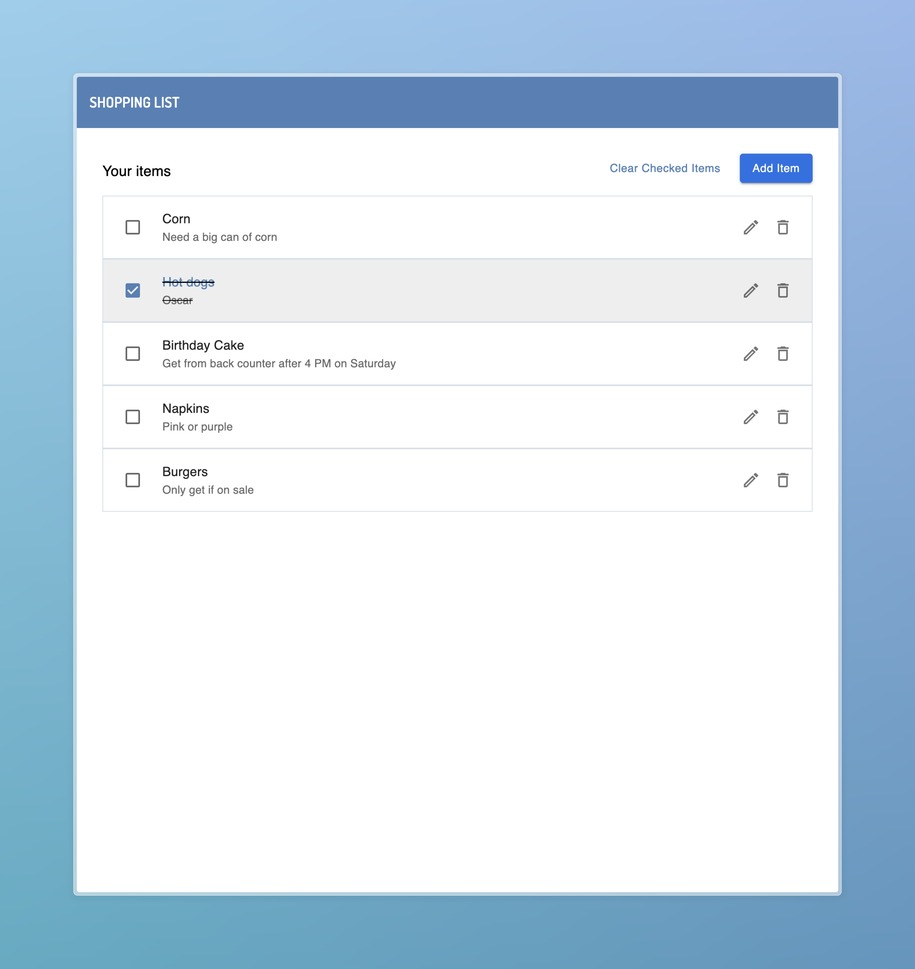
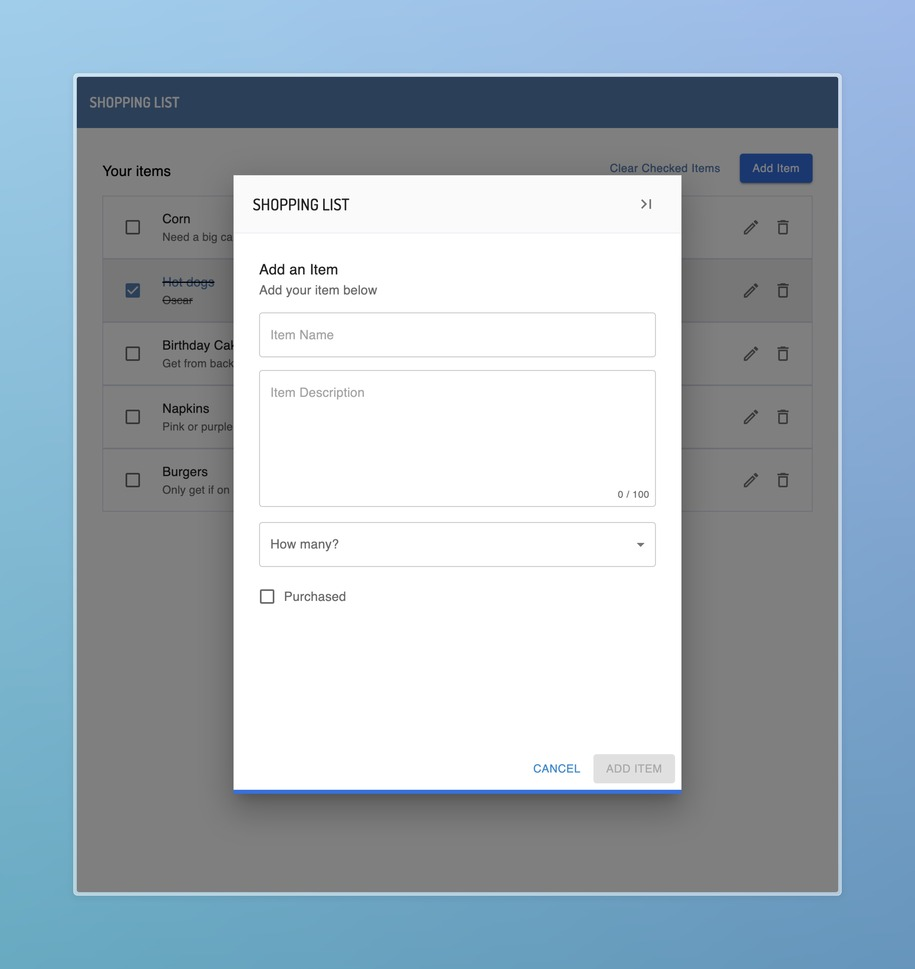

# Shopping List

Interview Take Home Project  
Simple shopping list - Given Figma designs and a list of technologies, build a simple shopping list app.




## Technologies

(From the assignments requirements)

- [React](https://reactjs.org/)
- [Material-UI](https://material-ui.com/)
- [Redux](https://redux.js.org/)
- [Node.js](https://nodejs.org/)
- [Express](https://expressjs.com/)
- [PostgreSQL](https://www.postgresql.org/)
- [Docker](https://www.docker.com/)

(Additional)

- [TypeScript](https://www.typescriptlang.org/) - For type safety and better developer experience.
- [@tanstack/react-query](https://react-query.tanstack.com/) - Helps manage data fetching and caching in the app. Simplifies the experience around handling error and loading states in particular.
- [Prisma](https://www.prisma.io/) - An ORM for the Postgres database.
  Allows a single schema definition that then generates TypeScript types, zod schemas, and a client library.
- [Zod](https://zod.dev/) +
  [Zod Prisma Types](https://www.npmjs.com/package/zod-prisma-types) - This removes that need to define zod schemas and TypeScript types in tandem
  with the Prisma schema.

## How to run locally

1. Run the built project containers - this will run the app, server, and database containers

```bash
  npm start
```

App will be available at [http://localhost:3000](http://localhost:3000) and server will be at [http://localhost:8000](http://localhost:8000) with hot-reloading enabled.

If you want to run the app and client on local servers manually, you can run the following commands:

```bash
  # start database container
  npm run start:db

  # start server container
  cd server
  npm install
  # Setup the database
  npm run db:generate
  npm run db:push
  npm run db:seed
  # Start the server
  npm run dev

  # start app container
  cd client
  npm install
  npm run dev
```

## Design Decisions

- I opted to make separate directories for the server and client to better tailor the configuration files to the React/Node.js environments. There is some overlap in the configuration, and both the client and server share the generated schemas/types from Prisma. Ideally this would have been handled in a separate package, but I wanted to keep the project simple and avoid the overhead of managing a separate package.

- Prisma is the source of truth for the data and this allowed me to focus on the business logic and UI of the app.

- I used React Query to manage the data fetching and caching in the app. I considered using redux-saga or redux-thunk, but the complexity of the app didn't warrant the overhead of managing the state with Redux, let alone adding a middleware to handle side effects.
  I used Redux anyway to manage some of the UI state.

- For the frontend, I used a mix of CSS modules and inline sx styles from Material-UI. I prefer CSS modules for the majority of the styling, but I find that Material-UI's sx prop is very useful for quick styling of components. If I were to continue working on this project, I would likely lean more heavily on the MUI theme and sx prop for styling as it is more in-line with MUI best practice and helps with scaling MUI projects.

- In this simple example, having the checkbox action be directly tied to the item's backend completion status is fine. In a more complex app, I would likely have a separate "completed" state in the UI that would be updated on the client side and then synced with the backend. This would allow for a more responsive UI and better user experience. `react-query` has some optimistic state features and React 19 has a new `useOptimistic` hook that would be useful for this.
